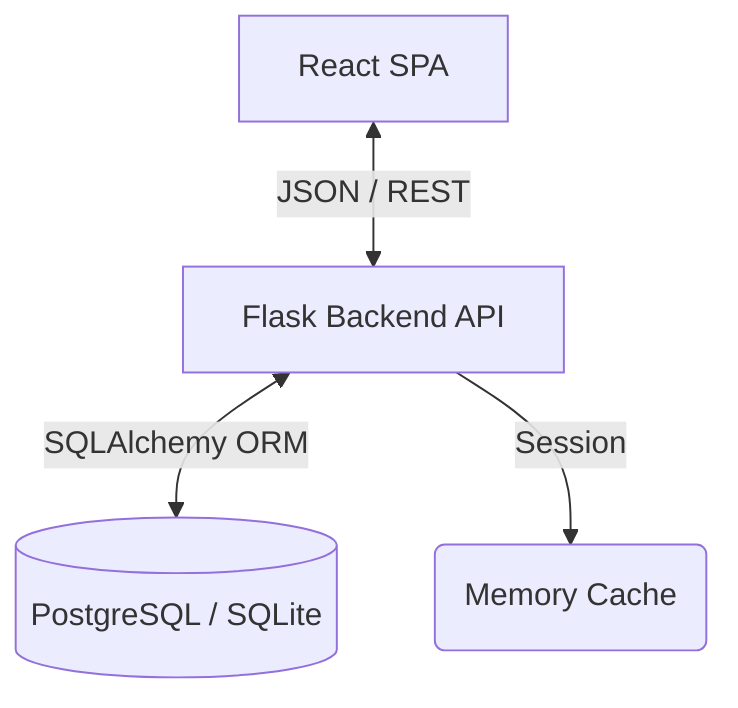

<div align="center">
  <h1>Student Campus Management System (SCMS)</h1>
  <p>A modern, full-stack campus administration portal built for speed, security, and scale.</p>

  [](https://opensource.org/licenses/MIT)
  [](https://reactjs.org/)
  [](https://flask.palletsprojects.com/)
  [](https://python.org)
</div>

<hr/>

The Student Campus Management System (SCMS) is a robust enterprise-level web application designed to centralize academic operations. By replacing fragmented spreadsheets and legacy portals with a unified, role-based SPA (Single Page Application), SCMS enables Administrators, Faculty, and Students to interact seamlessly in real-time.

---

## 🚀 Features

- **Multi-Tenant Role-Based Access Control (RBAC)**: Secure partitioning for Admin, Faculty, and Student users.
- **Academic Directory Management**: Streamlined CRUD operations for Faculty and Student records.
- **Course & Enrollment Workflows**: Advanced relationship mapping connecting Students to specific Courses under assigned Faculty.
- **Real-Time Grading & Transcripts**: Instantaneous GPA aggregation (10.0 scale) and highly-formatted printable academic transcripts.
- **Live Attendance Tracking**: Bulk-save functionalities for daily attendance logging.
- **Export & Analytics**: Native CSV exports for offline spreadsheet tracking and dynamic Dashboard aggregates.
- **Global Broadcasts**: System-wide announcements and individualized push notifications.

---

## 🏗 Architecture



### 💻 Technology Stack

**Frontend**
- React 18 (Vite)
- TypeScript
- Tailwind CSS (Utility-first styling, Glassmorphism design)
- Axios (API interception & CSRF Handling)
- Lucide React (Iconography)

**Backend**
- Python (3.10+)
- Flask (Application Factory Pattern)
- SQLAlchemy (Database ORM)
- Flask-Login & Flask-WTF (Security & Session Management)

---

## 📁 Folder Structure

```text
SCMS-main/
├── backend/
│   ├── app/
│   │   ├── api/        # REST Controllers (Blueprints)
│   │   ├── models/     # SQLAlchemy Database Schemas
│   │   └── auth/       # Authentication Logic
│   └── wsgi.py         # Application Entrypoint
├── frontend/
│   ├── src/
│   │   ├── components/ # React UI Views & Layouts
│   │   ├── contexts/   # Global State (Auth, Toasts)
│   │   └── api/        # Axios Services
│   └── package.json
└── docs/               # Advanced documentation
```

---

## ⚙️ Installation & Setup

### 1. Database & Environment Initialization

Create a `.env` file in the `backend/` directory:
```env
FLASK_APP=wsgi.py
FLASK_ENV=development
SECRET_KEY=replace-with-a-very-strong-random-key
DATABASE_URL=sqlite:///scms.db
```

### 2. Backend Setup
```bash
cd backend
python -m venv venv
source venv/bin/activate  # Or `venv\Scripts\activate` on Windows
pip install -r requirements.txt
flask db upgrade          # Execute database migrations
python run.py             # Start the development server on port 5000
```

### 3. Frontend Setup
```bash
cd frontend
npm install
npm run dev               # Start the Vite server on port 5173
```

---

## 🔑 Demo Credentials

If seeded with standard development data, the following credentials provide access to the respective portals:

| Role | Email | Password |
|---|---|---|
| **Admin** | `admin@scms.edu` | `admin` |
| **Faculty** | `alice.smith@scms.edu` | `password123` |
| **Student** | `alex.johnson@scms.edu` | `password123` |

---

## 📸 Screenshots

*(Screenshots will be added in a future release)*

---

## 📡 API Overview

The backend uses a standard RESTful architecture. 

- `POST /api/auth/login` - Authenticate users and acquire HttpOnly session cookies.
- `GET /api/dashboard/stats` - Fetch contextual analytics (GPA, attendance metrics).
- `GET /api/reports/csv/*` - Stream real-time CSV exports.

*For full API schemas, please refer to [docs/API.md](docs/API.md).*

---

## 🛡️ Security Features

- **CSRF Tokens**: All state-changing methods (POST, PUT, DELETE) dynamically require an `X-CSRFToken` header.
- **HttpOnly Cookies**: Session tokens are strictly hidden from JavaScript access protecting against XSS interception.
- **SQL Injection Prevention**: Forced utilization of the SQLAlchemy ORM prevents injection vectors.
- **Role-Based Isolation**: Direct API endpoints actively validate the `current_user.role` enum against unauthorized access patterns.

---

## 🗺️ Roadmap & Future Enhancements

- [ ] Bulk CSV imports for Student and Faculty registration.
- [ ] Automated SMTP email integrations for grading notifications.
- [ ] Exportable analytics visualizations (Chart.js integration).
- [ ] Native PWA manifest deployment for mobile offline support.

---

## 🤝 Contributing

We welcome contributions! Please review our [CONTRIBUTING.md](CONTRIBUTING.md) for guidelines on how to format commits, adhere to PEP8/Prettier, and submit Pull Requests. Be sure to review our [Code of Conduct](CODE_OF_CONDUCT.md).

---

## 📄 License

This project is licensed under the MIT License - see the [LICENSE](LICENSE) file for details.

---
*Built with ❤️ for Educational Institutions globally.*